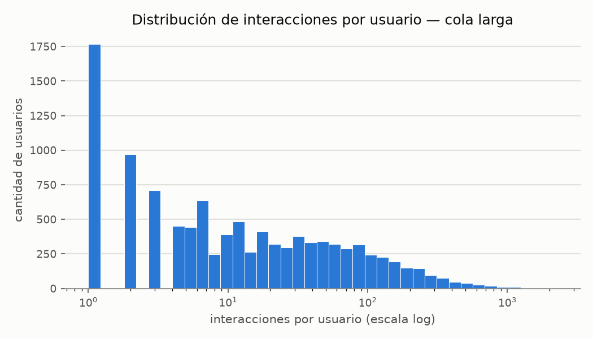
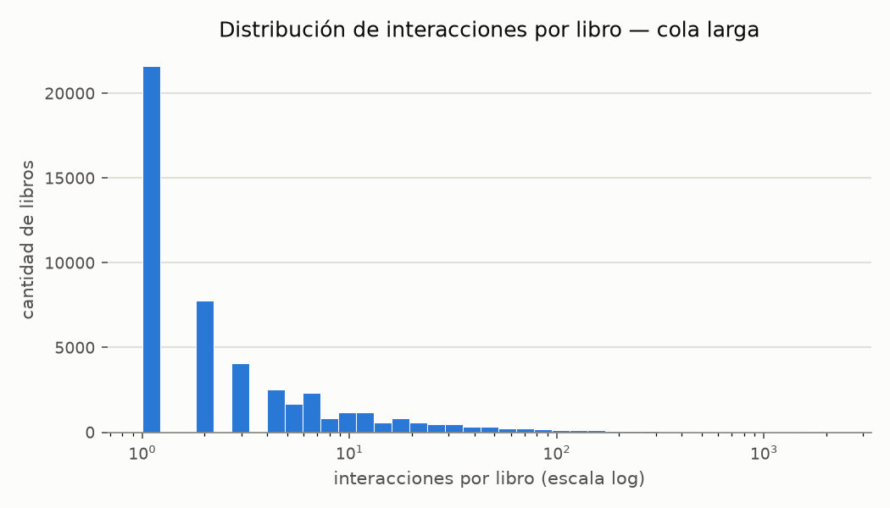
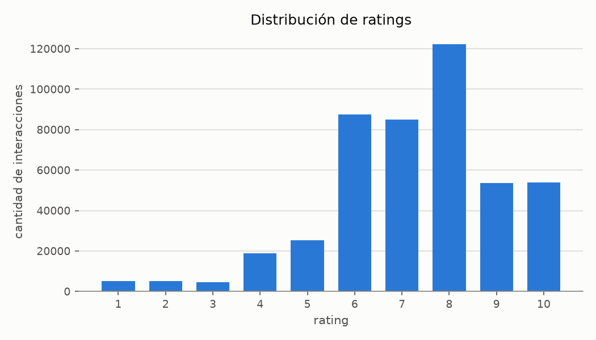
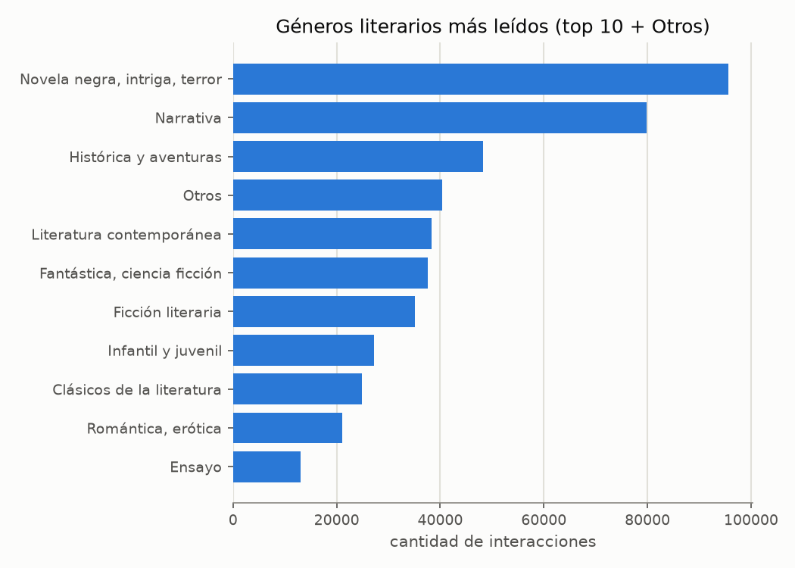
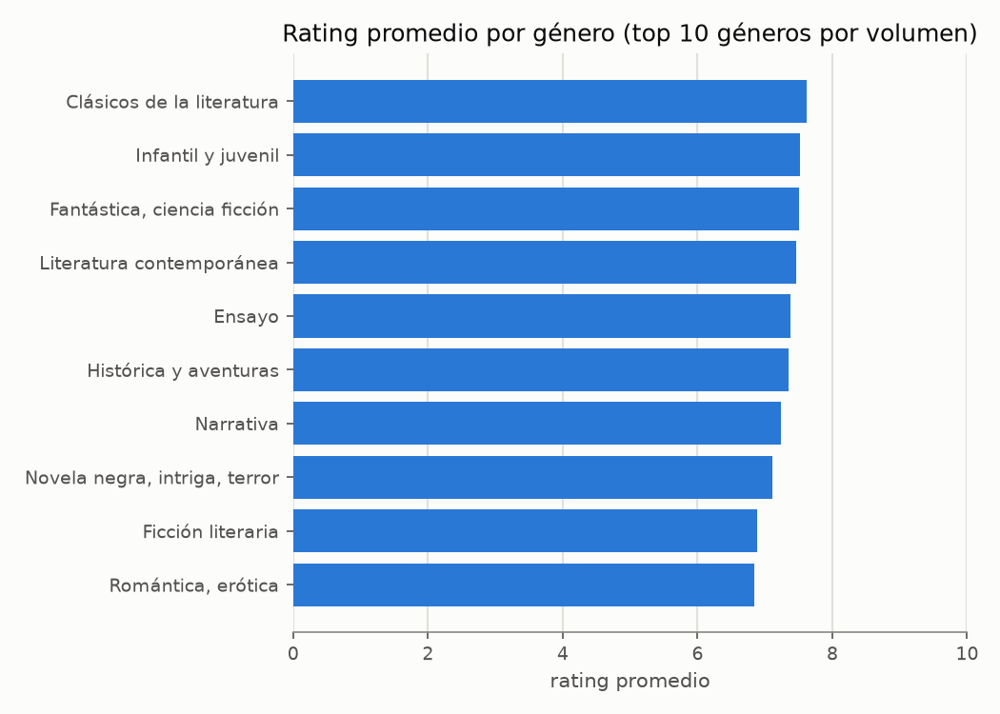
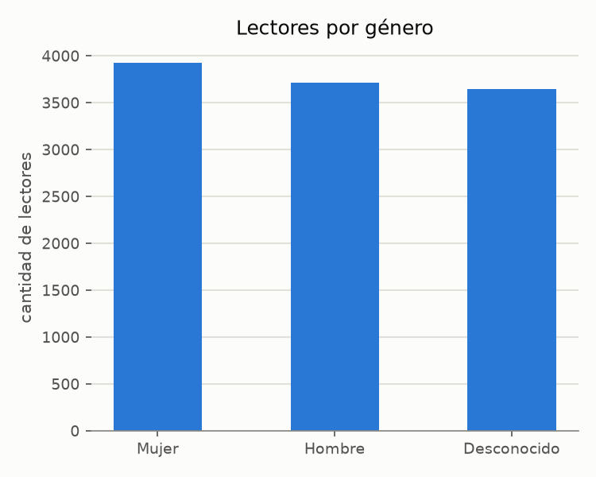
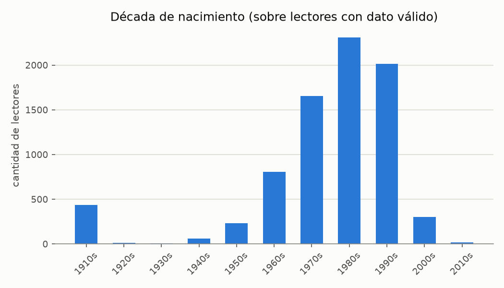

# EDA — Análisis exploratorio de datos

Generado con `uv run python scripts/eda.py` (script reproducible en
`scripts/eda.py`, gráficos en `docs/eda/`). Este documento resume los
hallazgos; los números completos están en el output del script.

## Resumen general

- **461,408** interacciones, **11,285** lectores registrados, **128,743**
  libros en el catálogo.
- Pero solo **10,673** lectores (94.6%) y **48,137** libros (37.4% del
  catálogo) tienen al menos una interacción — el resto son perfiles/libros
  sin actividad.
- **Sparsity** de la matriz usuario-libro: **99.91%** — típico de un
  dataset de recomendación real, confirma que un modelo de vecinos
  puro (sin regularización/reducción) va a sufrir.
- `fecha` parsea correctamente en 99.9998% de los casos (formato
  `dd-mm-yyyy`), rango **2008-02-24 a 2024-12-31** — 16 años de historial.
- `rating` es un entero de **1 a 10** (no 1-5 como asumía inicialmente),
  media 7.26, std 1.82 — sesgado hacia ratings altos, como es normal en
  plataformas donde la gente mayormente reseña lo que le gustó.

## Calidad de datos

- **Corregido un supuesto erróneo de la sesión anterior:** los caracteres
  `�` que aparecían en `titulo`/`resumen`/`genero` al imprimir por consola
  **no son mojibake real** — es un glitch de la consola de Windows al
  renderizar tildes (`Í`, `ó`, etc.), el dato en sí está bien codificado en
  UTF-8. No hay que "limpiar" encoding en estas columnas.
- **Hallazgo real importante:** el 60.76% de los libros del catálogo
  tienen toda su metadata nula (`titulo`, `autor`, `genero`, `editorial`,
  `anio_edicion`, `isbn`, `resumen`, `img_src` — todo excepto `id_libro`).
  A primera vista parece grave, pero **no afecta al modelo**: de los
  48,137 libros que efectivamente tienen interacciones, el **99.85%**
  tiene género conocido, y **el 100% de los usuarios tiene al menos un
  libro con género conocido** en su historial. La metadata nula es
  prácticamente toda de libros del catálogo que nadie leyó (scrape
  incompleto que no llegó a completarse para el long tail no consumido).
  Esto habilita el modelo de popularidad por género sin necesidad de
  imputar metadata.
- IDs huérfanos son mínimos: 0.046% de interacciones referencian un
  `id_libro` inexistente en `libros`, 0.026% un `id_lector` inexistente en
  `lectores`. Sin duplicados en `libros.id_libro`, `lectores.id_lector` ni
  en pares `(id_lector, id_libro)` de interacciones.
- `lectores.nacimiento`: **30.4% vacío**. De los válidos, rango 1910-2013
  (algunos extremos como 1910s/2010s son sospechosos y probablemente
  ruido de carga/typos, pero el volumen es chico como para invalidar la
  franja).
- `lectores.genero` (género del lector, no confundir con género
  literario): Mujer 34.8%, Hombre 32.9%, **`-` (desconocido) 32.3%** — un
  tercio sin dato.
- `lectores.vive_en`: solo 4.7% vacío, buena cobertura.

## Interacciones por usuario y por libro (cola larga)

Mediana de **9 interacciones/usuario**, pero el p99 llega a 478 y el
máximo a 2,260 — cola larga marcada, típico de recsys. Un 16.5% de los
usuarios activos tiene una sola interacción (relevante: son justamente
los que `split_train_val` manda enteros a train, sin aportar a
validación).

Mediana de solo **2 interacciones/libro**; el p99 llega a 141 y el máximo
a 2,231. La cola larga es todavía más marcada del lado de los libros —
buena parte del catálogo activo tiene muy poca señal, lo cual refuerza la
utilidad de un fallback jerárquico (género → franja etaria → global) para
libros/usuarios con poca evidencia propia.

## Ratings

Distribución concentrada entre 6 y 10, con pico en 8 — consistente con el
sesgo positivo ya mencionado en el resumen general.

## Géneros literarios

*Novela negra, intriga, terror* y *Narrativa* dominan el volumen de
interacciones, bastante por encima del resto. Hay **66 valores únicos**
en `libros.genero`, pero varios son duplicados semánticos por
capitalización/typo (ej. "No Ficción" vs "No ficción") — vale la pena
normalizar antes de usarlos como clave de agrupación en el modelo v1.

Los ratings promedio por género están bastante parejos (6.8 a 7.6 sobre
10) — no hay un género que la gente puntúe sistemáticamente mal, así que
el score bayesiano por género (igual que en v0, pero con `C`/`m`
calculados dentro de cada género) debería comportarse razonablemente sin
distorsiones raras entre géneros.

## Demografía de lectores

Bastante balanceado entre Hombre/Mujer, con un tercio desconocido (ya
mencionado arriba). Este campo es el género *del lector*, no se usa para
la preferencia de género literario del modelo v1.

Concentración fuerte en lectores nacidos en los **80s y 90s**. Confirma
la decisión de usar franja de nacimiento (década) en vez de "edad": no
hay una fecha de referencia confiable para calcular edad real, y con
30.4% de nulos en `nacimiento`, el fallback por franja va a cubrir una
fracción más chica de usuarios que el fallback por género literario.

## Conclusiones para v1 (popularidad segmentada)

1. El género literario es una señal viable y con buena cobertura (100%
   de usuarios con >=1 libro de género conocido) — es el fallback
   primario correcto.
2. La franja de nacimiento cubre ~70% de los lectores — buen segundo
   fallback, pero hay que asegurarse de que la popularidad global siga
   como último recurso para el 30% restante.
3. Conviene normalizar `libros.genero` (capitalización/espacios) antes de
   agrupar, para no fragmentar el mismo género en variantes distintas.
4. La cola larga tanto de usuarios como de libros valida la hipótesis de
   partida: hay mucho margen para que un modelo personalizado (aunque sea
   tan simple como popularidad por género) supere a v0.
