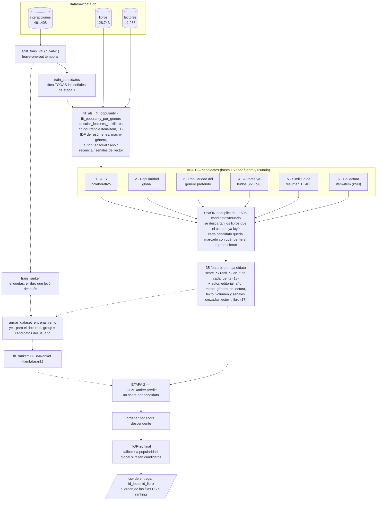

# Estado del arte del proyecto (para explicar a colegas)

Resumen autocontenido, pensado para poder explicarle el proyecto a
alguien que no siguió la sesión a sesión — qué problema resuelve, qué
arquitectura usa, con qué hiperparámetros, cómo se valida y qué falta.
No repite el *por qué* de cada decisión (eso está en
`decisiones.md`/`bitacora.md`) ni el detalle feature por feature (eso
está en `features.md`) — acá es la foto completa, un nivel más arriba.

## El problema

Recomendar libros para una competencia de Kaggle evaluada con
**NDCG@20**: para cada lector hay que entregar un ranking de 20 libros
(el orden importa), y se puntúa según si el libro que ese lector
efectivamente leyó después aparece cerca del principio de esa lista.

Datos: `data/raw/data.db` (sqlite), tres tablas —
`interacciones(id_lector, id_libro, fecha, rating)`,
`lectores(id_lector, nombre, genero, vive_en, nacimiento)`,
`libros(id_libro, titulo, autor, genero, editorial, anio_edicion, isbn,
resumen, img_src)`. Volumen: 461.408 interacciones, 11.285 lectores
(10.673 con actividad), 128.743 libros en catálogo (48.137 con al menos
una interacción). La matriz usuario-libro tiene **99.91% de sparsity**.

## Glosario: qué es ALS, qué es LightGBM, qué es "el ranker"

El resto del documento usa estos tres nombres todo el tiempo. Si ya
sabés qué son, saltate esta sección.

### ALS (*Alternating Least Squares*) — filtrado colaborativo

El punto de partida del filtrado colaborativo es la matriz
**usuario×libro**: una fila por lector, una columna por libro, y en la
celda `(u, i)` cuánto le gustó el libro `i` al lector `u` (acá, el
rating 1-10; ver la sección de ALS más abajo). Es una matriz enorme y
casi vacía — 99.91% de las celdas son cero.

ALS **factoriza** esa matriz: busca dos matrices mucho más chicas,
`U` (un vector de 128 números por usuario) y `V` (un vector de 128
números por libro), tales que el producto interno entre el vector del
usuario `u` y el del libro `i` aproxime la celda observada `(u, i)`.
Esos vectores son los *embeddings*: cada
usuario y cada libro quedan ubicados en un mismo espacio latente de 128
dimensiones, aprendido de los datos (nadie define qué significa cada
dimensión). La gracia es que el producto `U · Vᵀ` está definido para
**todas** las celdas, incluidas las 99.91% vacías — ahí es donde salen
las recomendaciones: los libros que el usuario no leyó pero cuyo
embedding cae cerca del suyo.

El "*alternating*" es el algoritmo de optimización. Minimizar el error
sobre `U` y `V` **a la vez** es un problema no convexo (el término
`u·v` es un producto de dos incógnitas), pero si se **fija** una de las
dos, el problema sobre la otra es una regresión de mínimos cuadrados
regularizada común y corriente, con solución en forma cerrada — un
sistema lineal por fila. Entonces se alterna: fijar `V` y resolver
todos los `u`, fijar `U` y resolver todos los `v`, repetir
(`iterations=20`). Cada paso baja el error de forma garantizada y es
paralelizable por fila, que es lo que hace a ALS escalable y el
baseline estándar de filtrado colaborativo desde hace ~15 años (la
variante para feedback implícito con pesos de confianza es
Hu/Koren/Volinsky 2008, que es la que implementa la librería
`implicit`).

**Rol concreto acá**: ALS es **una de las 6 fuentes de candidatos**, no
el modelo final. Aporta su top-150 por usuario, y además su
infraestructura se reusa para otras piezas: la matriz sparse y los
índices `fila_por_usuario`/`libros_por_columna` que devuelve `fit_als`
son los mismos que usan la co-lectura ítem-ítem y el perfil TF-IDF.
Limitación heredada: solo alcanza a usuarios con fila en esa matriz —
un usuario sin historial en `train_candidatos` no recibe candidatos de
ALS (ni de co-lectura, ni de resumen), y cae al fallback de
popularidad.

### LightGBM y `LGBMRanker` (`lambdarank`) — la etapa de reranking

**LightGBM** es un framework de *gradient boosted decision trees*: un
ensamble de árboles de decisión entrenados en secuencia, donde cada
árbol nuevo se ajusta al error que dejaron los anteriores. Comparado
con una red neuronal, es lo que mejor funciona "de fábrica" sobre datos
**tabulares heterogéneos** como los de acá: 35 columnas con escalas
completamente distintas (un rank entero de 0 a 150, una similitud
coseno en [0,1], un conteo de interacciones, un flag 0/1), sin
normalizar nada, capturando no-linealidades e interacciones entre
features sin que haya que declararlas.

`LGBMRanker` con `objective="lambdarank"` es la variante de
**learning-to-rank**, y es la parte menos obvia: **no predice un valor
absoluto ni clasifica binario**. Se entrena con los ejemplos agrupados
(el parámetro `group` de `fit`: acá, un grupo = todos los candidatos de
un mismo usuario) y lo que optimiza es el **orden dentro de cada
grupo**. LambdaRank hace eso ponderando el gradiente de cada par de
candidatos por cuánto cambiaría la métrica de ranking (NDCG) si se
intercambiaran las posiciones de ese par — una aproximación
diferenciable de NDCG, que como métrica es escalonada y no derivable.
Consecuencia práctica: el número que devuelve `.predict()` **no tiene
escala interpretable** (no es una probabilidad ni un rating estimado),
solo sirve para ordenar candidatos del mismo usuario entre sí.

**Rol concreto acá**: es la **etapa 2**. Recibe la unión de candidatos
de las 6 fuentes con sus 35 features y aprende a combinarlas — en vez
de decidir a mano cómo pesar "ALS lo puso 3ro" contra "es de un autor
que ya leyó" contra "su resumen se parece a lo que viene leyendo".

### "El ranker": ojo, el nombre se usa para dos cosas

Vale la pena aclararlo porque es una fuente real de confusión al leer
el resto de la documentación del proyecto:

| Cuando se dice… | Puede significar… |
|---|---|
| **el ranker** / `--model ranker` / `models/ranker.py` / "récord del ranker" | El **modelo completo del proyecto**: el pipeline de dos etapas entero (6 fuentes de candidatos + reranking). Es el sentido más frecuente. |
| **el ranker** / `fit_ranker` / `modelo_ranker` / "el ranker aprende a…" | Solo la **segunda etapa**: el `LGBMRanker` de LightGBM que reordena. |

En este documento se intenta decir "**el ranker**" (o "el pipeline")
para el primer sentido y "**el `LGBMRanker`**" para el segundo, pero en
`bitacora.md` y en los docstrings del código los dos usos conviven.
Regla práctica para desambiguar: si la frase habla de candidatos,
fuentes o del score de Kaggle, es el pipeline; si habla de features,
`feature_importances_`, `num_leaves` o `lambdarank`, es el LightGBM.

### Por qué dos etapas ("retrieval + ranking")

El patrón estándar de sistemas de recomendación de producción, y la
razón es de costo: calcular 35 features y correr LightGBM sobre los
128.743 libros del catálogo × cada usuario es inviable, mientras que
hacerlo sobre ~695 candidatos por usuario es barato. La etapa 1 usa
modelos rápidos y aproximados para bajar el catálogo a un puñado de
candidatos; la etapa 2 gasta el modelo caro y preciso solo ahí. El
corolario incómodo, y el hallazgo central de este proyecto: **la etapa
1 fija un techo duro** — si el libro que el usuario efectivamente iba a
leer no está entre los candidatos, no hay reranking que lo recupere
(hoy ese techo, el *recall* del set de candidatos, es 0.512).

## Récord actual

**0.05262 de NDCG@20 en Kaggle** (2026-09-01), con el modelo
`"ranker"` de `src/recsys/models/ranker.py`. Progresión completa de
todos los modelos probados, con el score real de Kaggle al lado del
local (siempre hay que mirar los dos, ver sección de validación):

| Modelo | NDCG@20 local | NDCG@20 Kaggle |
|---|---|---|
| Popularidad global (bayesiana) | 0.006620 | 0.01024 |
| Popularidad segmentada (género → franja → global) | 0.013719 | 0.01558 |
| ALS (factors=128, reg=0.1, rating crudo) | 0.094406 ± 0.001359 (CV 3 seeds) | 0.03864 |
| Ranker, 3 fuentes de candidatos (26 features) | 0.109735 ± 0.003719 | 0.04831 |
| Ranker, 4 fuentes (+autor ya leído, 29 features) | 0.117495 ± 0.002562 | 0.05140 |
| Ranker, 5 fuentes (+similitud de resumen, 32 features) | 0.120547 ± 0.002674 | 0.05181 |
| Ranker, 6 fuentes (+co-lectura ítem-ítem/kNN, 35 features) | 0.121983 ± 0.002949 | **0.05262 (récord actual)** |

## Arquitectura: candidatos + reranking

No es un solo modelo — son dos etapas, el patrón estándar de sistemas
de recomendación de producción ("*retrieval + ranking*"):

1. **Generación de candidatos**: seis fuentes independientes proponen,
   cada una, hasta 150 libros por usuario (`n_por_fuente=150`). Se unen
   sin duplicar — cada candidato queda marcado con qué fuente(s) lo
   propusieron.
2. **Reranking**: un `LGBMRanker` (LightGBM, gradient boosted trees)
   toma la unión de esos candidatos, cada uno con 35 features, y
   aprende a reordenarlos mejor de lo que cualquier fuente por sí sola
   podría.

Ninguna fuente por sí sola alcanza; en vez de combinarlas a mano (ej.
promediar scores), se entrena un modelo supervisado para que aprenda
cómo pesarlas. El filtrado colaborativo (ALS) sigue siendo la columna
vertebral de los candidatos — LightGBM es la capa de reranking encima,
no un reemplazo.

### Las 6 fuentes de candidatos

| # | Fuente | Qué propone | Código |
|---|---|---|---|
| 1 | **ALS** (filtrado colaborativo) | Top-150 según `implicit.recommend`, con el rating explícito (1-10) usado directamente como confianza | `models/als.py` |
| 2 | **Popularidad global** | Top-150 del ranking bayesiano global | `models/popularity.py` |
| 3 | **Popularidad por género preferido** | Top-150 dentro del género literario que más leyó el usuario | `models/popularity_segmentada.py` |
| 4 | **Autores ya leídos** | Hasta 20 libros sin leer por cada autor que el usuario ya leyó, rankeados por popularidad global | `ranker.generar_candidatos_con_features` |
| 5 | **Similitud de resumen** | Top-150 de *todo* el catálogo con resumen (~48k libros) más parecido al perfil TF-IDF de lectura del usuario — no depende de cuánta gente más leyó el libro | `ranker._generar_candidatos_por_resumen` |
| 6 | **Co-lectura ítem-ítem (kNN)** | Top-150 por score de co-lectura contra el historial del usuario (reusa la matriz de co-ocurrencia `cooc` ya calculada para la feature `score_coleido`) — sigue siendo colaborativo, pero trae candidatos que ALS no trae | `ranker.generar_candidatos_con_features` |

Total de candidatos por usuario: unión de las 6 fuentes, media ~695
(hasta ~820 para usuarios pesados).

### El flujo completo, de los datos crudos al top-20

Cómo se construye la lista de 20 libros de un usuario (flujo de
*inferencia*, el de `submit.py --model ranker`):

Las flechas punteadas son el **entrenamiento** del `LGBMRanker`, que
pasa una sola vez por corrida; las llenas son el camino que recorre
cada usuario a la hora de recomendarle. Ojo con dos cosas que el
diagrama comprime:

- **Etapa 1 y features son una sola función**
  (`generar_candidatos_con_features`): las 6 fuentes llenan un dict de
  candidatos por usuario y recién después, sobre esa unión, se calculan
  las 35 columnas. Se dibuja separado porque son dos decisiones
  distintas (qué candidatos traer vs. cómo describirlos), pero no son
  dos pasadas sobre los datos. Esa función se llama **dos veces** por
  corrida — una para los usuarios con los que se entrena el
  `LGBMRanker` y otra para los usuarios a los que hay que recomendarles
  — y es, lejos, la parte más cara del pipeline (~130s cada llamada).
- **En evaluación local el split tiene tres niveles, no dos** (ver más
  abajo): se parte una vez más para reservar un `test_final` con el que
  medir NDCG@20. En producción ese tercer tramo no existe — no hay un
  "futuro" que esconder, es la entrega real —, así que `submit.py`
  corta en `train_candidatos`/`train_ranker` y genera los candidatos
  finales con las mismas señales de etapa 1 que se usaron para entrenar
  el `LGBMRanker` (los libros ya leídos sí se filtran con **todos** los
  datos, incluida la última interacción).

## Modelos e hiperparámetros

### ALS (`models/als.py`)

`implicit.als.AlternatingLeastSquares` sobre la matriz sparse
usuario×libro, con el rating explícito (1-10) usado directamente como
confianza (no binarizado).

| Hiperparámetro | Valor |
|---|---|
| `factors` | 128 |
| `regularization` | 0.1 |
| `iterations` | 20 |
| `alpha` (peso `1+alpha*rating`) | `None` → confianza = rating crudo |
| `seed` | 42 |

Esta config es la que **mejor score dio en Kaggle real** (0.03864), no
la que mejor NDCG local dio: una búsqueda con `optuna` (30 trials)
encontró `factors=256, regularization=0.128, alpha=4.718` que mejoraba
el NDCG local +11.5% pero empeoraba Kaggle a 0.03341 — sobreajuste al
split usado en el sweep. Lección que quedó como norma del proyecto:
nunca confiar en una mejora de un solo split/seed sin confirmar con
validación cruzada, y desconfiar de mejoras grandes en un solo sweep.

### Popularidad (`models/popularity.py`)

Score bayesiano con shrinkage:
`score = (n/(n+C))·avg_rating + (C/(C+n))·m`, con `C = n.mean()`
(calculado sobre los datos recibidos, nunca hardcodeado) y `m` = rating
promedio global. Evita que un libro con 2 interacciones a 10 le gane a
uno con 500 interacciones a 8.5.

### Popularidad segmentada (`models/popularity_segmentada.py`)

Mismo score bayesiano, pero calculado sobre subconjuntos: género
literario preferido del usuario (52 categorías granulares
normalizadas, o 10 "macro-géneros" de dominio para las features del
ranker), género declarado del lector (Mujer/Hombre/desconocido), país,
franja de nacimiento (país y franja se probaron como features del
ranker y se descartaron — ver `decisiones.md`).

### LightGBM (`LGBMRanker`, dentro de `models/ranker.py`)

| Hiperparámetro | Valor |
|---|---|
| `objective` | `lambdarank` |
| `num_leaves` | 31 |
| `learning_rate` | 0.05 |
| `n_estimators` | 200 |
| `random_state` | 42 |

Hiperparámetros **conservadores a propósito**, sin tuneo agresivo: se
probó tunear con `optuna` tres veces (sobre bases de features
distintas) y las tres veces la mejora fue menor que el ruido entre
seeds — nunca se adoptó. `lambdarank` optimiza una aproximación
diferenciable del orden dentro de cada grupo de candidatos de un mismo
usuario (no accuracy/logloss por fila), que es justo lo que necesita
NDCG.

## Features (35 en total, catálogo completo en `features.md`)

Agrupadas por qué miden — cada fuente de candidatos aporta 3 columnas
(`score_*`/`rank_*`/`en_*`, el score y la posición que le dio esa
fuente, y si la propuso), y encima hay features "cruzadas" que no
vienen de ninguna fuente en particular:

- **Score/rank/en de cada una de las 6 fuentes** (18 features).
- **Volumen bruto**: cuántas interacciones tiene el libro y el usuario.
- **Autor**: ¿el usuario ya leyó a este autor?, ¿cuántos libros suyos?
- **Editorial**: historial del usuario con la editorial + tamaño del
  catálogo de la editorial (propiedad del libro, no del usuario).
- **Año de edición**: diferencia contra el año promedio que lee el
  usuario.
- **Diversidad de género**: cuántos géneros distintos leyó el usuario.
- **Recencia**: días desde la última interacción del usuario.
- **Co-lectura ítem-ítem** (`score_coleido`): cuánta gente que leyó lo
  mismo que este usuario también leyó el candidato (matriz de
  co-ocurrencia `X.T @ X`, sparse, ~3s para todo el catálogo).
- **Resumen/texto**: similitud coseno TF-IDF entre el resumen del
  candidato y el perfil de lectura del usuario.
- **Macro-género**: popularidad del candidato pooleada a 10 familias de
  género (en vez de las 52 granulares) + qué tan seguido lee el usuario
  ese macro-género.
- **Señales cruzadas lector↔libro**: popularidad segmentada por género
  *declarado* del lector, afinidad de la cohorte del mismo género por
  macro-género, edad del lector cuando se publicó el candidato.

Todas se calculan **solo con el tramo de entrenamiento** (nunca con
datos que el ranker vea como etiqueta), excepto la metadata estática
del libro (autor/editorial/año/resumen), que no depende del split.

### Importancia de features medida (seed 42, una sola corrida)

`scripts/evaluate_ranker.py` imprime `feature_importances_` en cada
corrida, pero el número nunca había quedado en un documento. Esto es la
foto del modelo actual de 35 features (seed 42: ALS 0.092851, ranker
**0.118625** — consistente con la CV de 3 seeds, 0.121983 ± 0.002949).

**Antes de leer la tabla, tres advertencias:**

1. **Es una sola corrida, no un promedio de 3 seeds ni una medición con
   desvío.** Sirve para orientarse, no para decidir. Este proyecto ya
   se comió el costo de sobre-interpretar un número sin desvío (ver
   `modelo_actual.md`, "Hallazgo incómodo"): las diferencias chicas
   dentro de esta tabla no son evidencia de nada.
2. **Hay dos medidas de importancia y acá divergen fuerte.** `split` =
   en cuántos nodos del ensamble se usó la feature (es lo que devuelve
   `feature_importances_` por default y lo que se venía mirando en el
   proyecto). `gain` = cuánta reducción de pérdida acumuló. `gain`
   premia mucho a las features que caen cerca de la raíz de los
   árboles (ahí hay más datos por nodo), así que concentra; `split` es
   más plano.
3. **Importancia ≠ contribución al NDCG.** Una feature muy usada puede
   estar sirviendo para segmentar, no para ordenar (ver la lectura de
   abajo). Para saber si una feature aporta al resultado, el
   instrumento del proyecto es el test pareado por usuario, no esta
   tabla.

Ordenada por `gain`:

| # | Feature | % gain | splits | % split |
|---|---|---|---|---|
| 1 | `n_interacciones_usuario` | 61.36% | 469 | 7.82% |
| 2 | `rank_als` | 16.62% | 344 | 5.73% |
| 3 | `n_libros_editorial_catalogo` | 4.93% | 223 | 3.72% |
| 4 | `score_als` | 1.98% | 313 | 5.22% |
| 5 | `rank_coleido_candidato` | 1.89% | 284 | 4.73% |
| 6 | `rank_autor_candidato` | 1.81% | 236 | 3.93% |
| 7 | `n_interacciones_libro` | 1.66% | 361 | 6.02% |
| 8 | `en_autor_leido` | 1.63% | 92 | 1.53% |
| 9 | `anio_edicion_dif` | 1.08% | 508 | 8.47% |
| 10 | `dias_desde_ultima_interaccion_usuario` | 0.92% | 442 | 7.37% |
| 11 | `frecuencia_genero_macro_usuario` | 0.68% | 319 | 5.32% |
| 12 | `score_autor_candidato` | 0.63% | 148 | 2.47% |
| 13 | `n_generos_distintos_usuario` | 0.56% | 145 | 2.42% |
| 14 | `score_coleido` | 0.56% | 236 | 3.93% |
| 15 | `popularidad_genero_macro_candidato` | 0.48% | 260 | 4.33% |
| 16 | `sim_resumen_historial` | 0.48% | 310 | 5.17% |
| 17 | `n_libros_autor_leidos` | 0.39% | 177 | 2.95% |
| 18 | `popularidad_genero_lector_candidato` | 0.33% | 231 | 3.85% |
| 19 | `score_coleido_candidato` | 0.32% | 124 | 2.07% |
| 20 | `score_resumen_candidato` | 0.30% | 71 | 1.18% |
| 21 | `frecuencia_genero_macro_por_genero_lector` | 0.29% | 151 | 2.52% |
| 22 | `rank_resumen_candidato` | 0.25% | 66 | 1.10% |
| 23 | `en_editorial_leida` | 0.22% | 46 | 0.77% |
| 24 | `n_libros_editorial_leidos` | 0.17% | 142 | 2.37% |
| 25 | `edad_lector_al_publicarse` | 0.17% | 129 | 2.15% |
| 26 | `rank_genero` | 0.09% | 61 | 1.02% |
| 27 | `score_popularidad` | 0.09% | 35 | 0.58% |
| 28 | `score_genero` | 0.07% | 62 | 1.03% |
| 29 | `rank_popularidad` | 0.02% | 15 | 0.25% |
| 30-35 | `en_als`, `en_popularidad`, `en_genero`, `en_autor_candidato`, `en_resumen_candidato`, `en_coleido_candidato` | **0.00%** | **0** | **0.00%** |

**Cómo se lee esto:**

- **`n_interacciones_usuario` domina el `gain` (61%) pero no está
  ordenando nada.** Es una feature **constante dentro del grupo de un
  usuario**: todos sus candidatos tienen el mismo valor, así que por sí
  sola no puede cambiar el orden entre ellos. Lo que hace es
  **segmentar**: parte el árbol por nivel de actividad del lector y
  deja que las ramas de abajo pesen distinto al resto de las features
  para un usuario con 5 interacciones que para uno con 300. Lo mismo
  vale, más abajo, para `dias_desde_ultima_interaccion_usuario` y
  `n_generos_distintos_usuario`. Que caiga en la raíz de casi todos los
  árboles explica también por qué acapara el `gain`.
- **ALS sigue siendo la columna vertebral del orden**: `rank_als` +
  `score_als` = 18.6% del `gain`, y son la primera señal
  *candidato-dependiente* de la tabla. Coherente con el resto del
  documento.
- **Las fuentes nuevas entran alto y por el `rank`, no por el
  `score`**: `rank_coleido_candidato` (5º) y `rank_autor_candidato`
  (6º) le ganan holgadamente a sus `score_*` respectivos (19º y 12º).
  Tiene sentido: los scores de esas fuentes están en escalas raras
  (conteos de co-lectura, popularidad global reciclada) mientras que la
  posición dentro de la fuente ya viene normalizada.
- **Sorpresa: `n_libros_editorial_catalogo` es 3ro por `gain`.** Es la
  feature de editorial que es propiedad *del libro* (cuántos títulos
  tiene esa editorial en todo el catálogo), no del historial del
  usuario — probablemente funciona como proxy de "editorial grande y
  establecida". No hay que confundirla con
  `en_editorial_leida`/`n_libros_editorial_leidos`, que sí quedan al
  fondo (23ª y 24ª).
- **Popularidad global y por género están casi al final**
  (`rank_popularidad` es la última con uso distinto de cero, 0.02%).
  Siguen siendo valiosas como *fuentes de candidatos* — que es para lo
  que están —, pero como señal de orden las tapan por completo ALS y
  co-lectura.

**El hallazgo más concreto: las 6 features `en_*` de fuente no se usan
nunca.** `en_als`, `en_popularidad`, `en_genero`,
`en_autor_candidato`, `en_resumen_candidato` y `en_coleido_candidato`
tienen **exactamente 0 splits** — LightGBM no las mira en ningún nodo.
La explicación es que son redundantes: "la fuente X propuso este
candidato" es exactamente `rank_X < n_por_fuente`, y el árbol prefiere
partir por el `rank_*`, que dice lo mismo *y además gradúa*. Como una
feature con 0 splits no contribuye al score, sacarlas dejaría el modelo
de 35 a 29 features sin cambiar las predicciones de esta corrida. Es
una observación, no una decisión tomada — habría que confirmar que el
patrón se repite en los 3 seeds antes de tocar nada. **Ojo con no
confundirlas** con `en_autor_leido` (8ª por `gain`, bien usada) y
`en_editorial_leida`: esas dos miden el *historial del usuario*, no de
dónde vino el candidato.

**Contra lo que decían las rondas anteriores** (`decisiones.md`,
`bitacora.md`, sobre bases de 23-29 features y mirando `split`):

- ✅ Se sostiene que **`en_editorial_leida` es de las señales más
  flojas** (23ª de 35 por `gain`, 27ª por `split`).
- ⚠️ **No se sostiene** que `score_coleido` y `sim_resumen_historial`
  estén "en el grupo de mayor peso": con 35 features quedan en el medio
  de la tabla (11ª y 8ª por `split`, 14ª y 16ª por `gain`). No es
  necesariamente una contradicción — ahora compiten con las features
  que trajeron las fuentes 4/5/6, que en buena medida capturan la misma
  señal —, pero conviene dejar de citar esa afirmación como vigente.

## Cómo se valida localmente

### Split de tres niveles (no un split simple)

Como el ranker usa scores de ALS/popularidad como *features*, esos
scores no pueden salir de datos que el ranker vea como etiqueta — si no,
memoriza en vez de aprender a combinar señales. Por eso hay tres
tramos, no dos:

1. **`train_candidatos`**: fitea ALS + popularidad + popularidad por
   género (las fuentes de la etapa 1) y calcula todas las features
   auxiliares.
2. **`train_ranker`**: etiquetas conocidas (la interacción más reciente
   de cada usuario dentro de este tramo) para entrenar el `LGBMRanker`.
3. **`test_final`**: hold-out aislado para medir NDCG@20 del pipeline
   completo (solo existe en evaluación local, no en producción).

Cada tramo sale de un **split leave-one-out temporal** (`split_train_val`
en `data.py`): se retiene la interacción *más reciente por fecha* de
cada usuario, no una muestra aleatoria — un split aleatorio filtra
información del futuro hacia train y sobreestima el NDCG local
fuertemente (medido: 0.260 con split aleatorio vs. 0.123 con el
corregido, mismo modelo).

### Validación cruzada sobre 3 seeds, no un split único

Todo el pipeline del ranker se evalúa con `scripts/evaluate_ranker.py`
sobre 3 seeds (42, 7, 123), mirando media *y* desvío — nunca un solo
número. Motivo real: un sweep de ALS que solo miró un split mejoró el
NDCG local +11.5% pero empeoró Kaggle -13.5% (sobreajuste al ruido de
ese split en particular).

### Métrica de diagnóstico: recall del set de candidatos

`scripts/recall_candidatos.py` mide qué fracción de los libros objetivo
de validación está *presente* entre los candidatos generados — el
techo absoluto de NDCG que puede lograr el reranking, sin importar qué
tan bueno sea LightGBM. Permite decidir sobre la etapa 1 (candidatos)
en minutos en vez de correr el CV completo (~20-25 min) para cada idea.
Regla aprendida: **no toda ganancia de recall se traduce en NDCG** — si
los candidatos nuevos no traen señal distinguible (solo más volumen),
el ranking se vuelve más difícil y el NDCG puede no acompañar (pasó al
subir `n_por_fuente` de 150 a 500: +30% recall, +0.7% NDCG).

### Test pareado por usuario (el criterio con más poder estadístico)

`scripts/comparar_features_pareado.py` compara dos configuraciones
sobre el **mismo contexto/seed** (mismo split, mismo fit de ALS) y mide
la diferencia de NDCG **por usuario**, no promedios independientes —
~5x más poder estadístico que comparar contra el desvío entre 3 seeds.
Se adoptó después de encontrar que varias mejoras que parecían
"confirmadas" (positivas en los 3 seeds, o incluso confirmadas en
Kaggle) eran estadísticamente indistinguibles de ruido con este test.

### La brecha local-vs-Kaggle

El número local **sobreestima** bastante el de Kaggle en términos
absolutos — se investigó y es principalmente varianza de muestra chica
en Kaggle (~832 usuarios de referencia, métrica donde la mayoría de
usuarios da NDCG=0) más una diferencia real de población: los usuarios
de `ejemplo.csv` tienen mucha más actividad (mediana 95 interacciones)
que el promedio de la evaluación local (mediana 9). Conclusión práctica
del proyecto: **comparar dentro del proyecto** (ranker vs. ALS solo, o
una versión de features vs. otra) es mucho más confiable que comparar
los valores absolutos entre sí.

### Criterio para decidir si gastar una submission de Kaggle

Cada submission es un recurso limitado (Kaggle limita cuántas por día).
El criterio vigente, validado explícitamente por el usuario tras
acertar en varios casos esta sesión: **si una mejora es positiva en los
3 seeds individualmente** (aunque no supere el desvío entre seeds),
vale la pena confirmarla con una submission real en vez de descartarla
solo por no pasar el umbral estricto. Si además pasa el test pareado,
mejor todavía — pero no es requisito excluyente.

## Qué se probó y no funcionó (para no repetirlo)

- **Tunear hiperparámetros de LightGBM** con `optuna`: probado 3 veces
  sobre bases de features distintas, las 3 veces la mejora fue menor
  que el ruido entre seeds. No se adopta más.
- **País del usuario (`vive_en`) y franja de nacimiento** como features
  del ranker: ambas empeoraron en 2 de 3 seeds. Quedó código de soporte
  sin usar en `popularity_segmentada.py` por si sirve con otro enfoque.
- **Subir `n_por_fuente` de 150 a 500**: +30% de recall de candidatos,
  pero el NDCG casi no se movió (+0.7%, dentro del ruido) y el costo de
  cómputo casi se duplicó. Descartado.
- **Modelos secuenciales (SASRec/GRU4Rec)**: descartados por los datos,
  no por costo — 67.5% de los gaps entre interacciones consecutivas son
  0 días y 45.7% de los usuarios tiene más de una interacción en su
  fecha máxima, así que el "orden" dentro de un día es en gran parte
  arbitrario, justo lo que un modelo secuencial necesitaría aprender.
- **LightFM / dos torres / factorization machines**: reemplazarían a
  ALS (que no es el cuello de botella) para meter metadata en el
  embedding — esa metadata ya está en las features del ranker, donde
  LightGBM la usa con más libertad. Alto costo de implementación, poca
  ganancia esperada.
- **Embeddings semánticos (`sentence-transformers`, local) en vez de
  TF-IDF** para el perfil de contenido (`sim_resumen_historial` + 5ª
  fuente de candidatos): recall del set de candidatos prácticamente
  igual (0.5115→0.5099) y NDCG@20 levemente peor (seed 42:
  0.118625→0.116862, test pareado −1.74 sigma) — no cumple ni el
  mínimo para pensar en un CV completo. El recall casi sin cambios es
  la pista clave: los embeddings casi no traen candidatos distintos a
  los de TF-IDF, contra la hipótesis de que iban a capturar
  parafraseo/sinónimos. Ver `experiments/decisiones.md` sección 15 y
  `bitacora.md` para el detalle y la hipótesis de por qué.

## Próximos pasos (agenda completa en `decisiones.md`)

El hallazgo central de las últimas sesiones: **el cuello de botella es
el generador de candidatos, no el reranking ni el modelo colaborativo**.
Atacar el recall de candidatos (agregar fuentes nuevas) dio las tres
mejoras más grandes y mejor validadas del proyecto (autor ya leído:
+5.9% en Kaggle; similitud de resumen: +0.8%; co-lectura ítem-ítem/kNN:
+1.56%), mientras que agregar más features sobre el mismo set de
candidatos viene con retornos decrecientes. Pero la señal se está
agotando: cada fuente nueva sube el recall pero baja un poco la
eficiencia de ranking (NDCG/recall) — la de kNN fue la más chica de las
tres, con la caída de eficiencia más marcada (-10%, vs. -22% del caso
ya descartado de `n_por_fuente=500`). Ideas pendientes, en orden de
prioridad:

1. Adaptar `scripts/comparar_features_pareado.py` (o un script nuevo)
   para comparar dos *generadores de candidatos* completos, no solo
   subconjuntos de `FEATURES` sobre el mismo contexto — hoy no hay
   forma barata de aislar si una fuente nueva de candidatos ayuda antes
   de correr el CV completo de 3 seeds (~20-25 min).
2. Features ponderadas por recencia (autor/editorial/co-lectura
   pesando más lo reciente, no todo el historial parejo).
3. Revisar si conviene refitear la etapa 1 (ALS/popularidad) sobre
   todos los datos después de entrenar el ranker, en vez de sobre
   `train_candidatos` como hoy en `submit.py`.

## Dónde mirar para más detalle

- **`experiments/features.md`**: catálogo completo, feature por
  feature, con qué mide y qué pasa si falta.
- **`experiments/decisiones.md`**: qué se decidió en cada punto,
  qué se conserva y qué quedó pendiente de revisar.
- **`experiments/bitacora.md`**: el razonamiento completo de cada
  decisión, con los números de cada experimento.
- **`experiments/log.csv`**: historial tabular de cada corrida (NDCG
  local y de Kaggle) para comparar entre sí.
- **`experiments/modelo_actual.md`**: el mismo modelo descrito con más
  detalle técnico, más el análisis dedicado de "¿cambiar de paradigma?"
  con las mediciones que lo respaldan.
